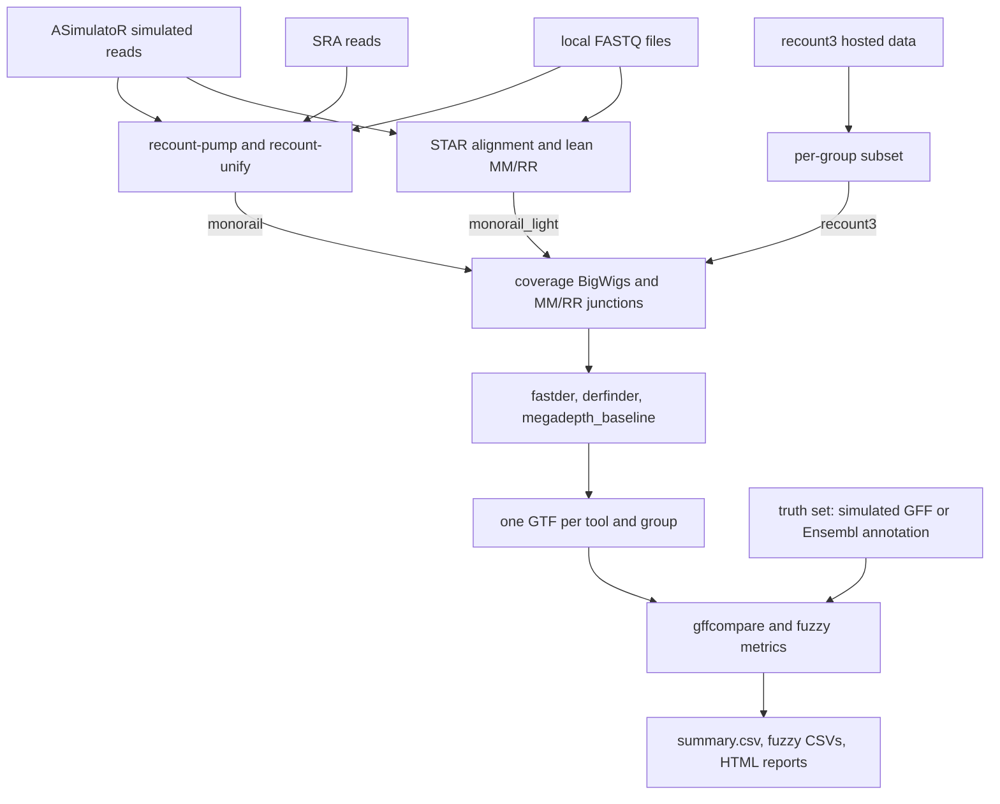

# FastDER Evaluation Snakemake Pipeline

This repository holds the evaluation pipeline for fastder and accompanies the fastder paper. It runs fastder on both simulated and real RNA-seq data and compares it against derfinder and a coverage-based baseline.

Simulated data is produced with ASimulatoR, which gives a known set of true transcripts to grade against. Real data comes either from recount3, where a study has already been processed by the Monorail pipeline, or from FASTQ files already on disk.

The pipeline is used in two ways. The first is method comparison: the benchmark compares fastder against derfinder and a coverage-only baseline, mainly on simulated data. There a known truth set gives precision and recall. The second is a worked biological example: the pipeline runs fastder on a TDP-43 knockdown and a matched control. Loss of TDP-43 is known to produce specific cryptic exons, so the expected result is known in advance. The simulation configs serve the first use, and the recount3 config serves the second.

The fastder code is a git submodule pointing at [imallona/fastder](https://github.com/imallona/fastder), a fork of [martinalavanya/fastder](https://github.com/martinalavanya/fastder). It has three changes this evaluation relies on: lean MM/RR parsing, reading coverage straight from BigWig through libBigWig instead of an intermediate BedGraph, and strand-aware stitching that carries the splice junction strand into the StitchedER output.

## Workflow at a glance

The run modes differ only in how the per-sample coverage BigWigs and the
MM/RR splice junction files are produced. Everything after that point is the
same.



## Benchmarking strategy at a glance

| Aspect | What the pipeline does |
|---|---|
| Question | fastder uses splice junction information when it calls expressed regions. Does that help, compared with tools that look only at coverage? |
| Tools compared | `fastder`, `derfinder` and `megadepth_baseline`. All three read the same coverage BigWigs, use the same CPM normalisation, and are run at the same parameter values. |
| Input data | Simulated reads (ASimulatoR, chr21, with a known set of true transcripts), or real data (a recount3 study, compared against the Ensembl annotation). |
| Parameters | Each tool is run at the same parameter values, for example `min_coverage`. The values are recorded in the `param_id`, so runs can be compared directly. |
| Grading | `gffcompare`, which asks for matching exon boundaries, plus softer measures: best Jaccard overlap, distance to the nearest boundary, how much of each locus is recovered, and strand agreement. |
| Grouping | Simulated runs are split by the type of splicing change. Real runs are split by sample group, for example a knockdown group and a control group. |
| Output | `summary.csv` and the `fuzzy_*.csv` files have `tool`, `scenario` and `param_id` columns; the HTML reports place the tools next to each other. |

## Running the Pipeline

### Prerequisites

1. Install Conda and Snakemake. Installation instructions are available at: https://snakemake.readthedocs.io/en/stable/getting_started/installation.html
   
   After installing Conda or Miniconda, Snakemake can be installed with:
   
   `conda create -c conda-forge -c bioconda -c nodefaults -n snakemake snakemake`

3. Install Singularity or Apptainer.

### Execution

1. Activate the Conda environment containing Snakemake:
   `conda activate snakemake`

2. Navigate to the workflow directory:
   `cd workflow/`

3. Run the pipeline:
   `snakemake --use-conda --use-singularity --cores <num_cores>`

Replace `<num_cores>` with the number of CPU cores to allocate.

`--use-singularity` is required: the `run_asimulator` rule pulls
`docker://biomedbigdata/asimulator` to provide the ASimulatoR R package, and
without that flag Snakemake skips the container directive and tries to run
the R script in the host environment, which fails with
`there is no package called 'ASimulatoR'`. The heavy backend additionally
needs Singularity for `recount-pump` and `recount-unify`.

### Run modes

A run is set by two config settings. `monorail.backend` chooses how the reads
are processed. For the two backends that process reads, `monorail.pump_source`
chooses where the reads come from.

Every run ends at the same fastder inputs, namely per-sample coverage BigWigs
and the MM/RR splice junction files.

Backends (`monorail.backend`):

- `monorail` (default): the full Monorail stack. Runs `recount-pump` and
  `recount-unify` in Singularity containers: STAR alignment, BigWig coverage,
  junction extraction, then aggregation across samples. Downloads the multi-GB
  Monorail reference indexes the first time it runs.
- `monorail_light`: a lighter alternative. Runs a chromosome-restricted STAR
  alignment directly, then a small Python script builds the lean MM and RR
  files from the STAR `SJ.out.tab` outputs. No Singularity and no whole-genome
  reference download.
- `recount3`: no read processing. Downloads coverage and junctions that the
  recount3 resource already holds, Monorail-processed, for a published SRA
  study, and reshapes them per sample group. No alignment and no containers.
  See `workflow/rules/recount3.smk`.

Read sources for the `monorail` and `monorail_light` backends
(`monorail.pump_source`):

- `asimulator`: reads simulated by ASimulatoR.
- `sra`: reads downloaded from SRA at run time.
- `local`: paired FASTQ files already on disk, listed under
  `monorail.local_samples`. This is the SRA path with the download step
  skipped.

The `recount3` backend has no read source; its data comes from recount3
directly.

Seven configs are included:

- `config/config_quick_light.yaml`: 2 samples, 100k reads, chr21, monorail_light. Smoke test.
- `config/config_quick.yaml`: 2 samples, 100k reads, chr21, monorail backend.
- `config/config_medium_light.yaml`: 5 samples, 1M reads, chr21, monorail_light.
- `config/config_full_light.yaml`: 5 samples, 10M reads, chr21, monorail_light. Recommended for the simulation figures.
- `config/config.yaml`: 5 samples, 10M reads, chr21, monorail backend (full Monorail stack).
- `config/config_local.yaml`: local FASTQ files, monorail_light backend. Edit `monorail.local_samples` to point at your own paired FASTQ files.
- `config/config_recount3.yaml`: real data, recount3 backend. TDP-43 knockdown versus scramble control in motor-neuron RNA-seq (recount3 study SRP166282, GEO GSE121569), split into a knockdown group and a control group, on chr8 and chr19. `--use-singularity` is not needed for this config.

To pick a non-default config, set the `FASTDER_EVAL_CONFIG` environment
variable. Snakemake's own `--configfile` flag does a deep merge that unions
nested dicts like `asimulator.samples`; the env var fully replaces the
default config instead. Example:

```
FASTDER_EVAL_CONFIG=../config/config_quick_light.yaml \
  snakemake --use-conda --use-singularity --cores 12
```

### Scenarios and sample groups

The pipeline runs every downstream stage once per scenario, and the results carry a `scenario` column. What the scenario axis means depends on the input. The ASimulatoR scenarios are controlled conditions for method comparison; the recount3 groups are the two arms of the worked biological example.

For ASimulatoR input there are two scenarios. They differ in which transcripts contribute reads to the coverage track that fastder sees:

- `template_and_variant`: the ASimulatoR default. Both the canonical (template) transcript and the alternative form are simulated, so a skipped exon still has reads from the template and the coverage track shows a dip rather than a hard zero.
- `variant_only`: the FASTQ is post-filtered to drop reads whose source transcript carries `template=TRUE` in the splicing_variants GFF, and the GFF is rewritten to keep only the alternative isoforms. The skipped exon then has zero coverage, and the gffcompare truth set contains only the alternative isoforms.

For recount3 input the scenario axis carries the sample groups instead, for example a knockdown group and a control group, so each group is called and graded on its own.

For SRA and local FASTQ input there is a single scenario, `all`.

### Outputs

After a successful run, `results/<config>/` contains:

- `summary.csv`: gffcompare metrics per (tool, scenario, sample, parameter combination), at every level (Base, Exon, Intron, Intron chain, Transcript, Locus), plus matching counts and missed and novel ratios.
- `chain_stats.csv`: per-transcript statistics parsed from the fastder GTFs (number of exons, total exonic length, score, chromosome, strand).
- `fuzzy_jaccard.csv`: per reference transcript, the highest exonic Jaccard against any called transcript on the same strand. This drops gffcompare's exact-boundary requirement.
- `fuzzy_distances.csv`: signed bp distance from each called exon boundary to the nearest reference boundary on the same strand.
- `fuzzy_locus_recall.csv`: fraction of reference loci with at least f of their exonic length covered, at thresholds f from 0.05 to 1.0 in 0.05 steps.
- `fuzzy_strand.csv`: each called StitchedER classified as concordant, discordant, unstranded, or unmatched against the best-overlapping reference transcript.
- `summary.html`: the summary report covering the CSVs above, faceted by scenario.
- `benchmarks.html`: runtime and memory report parsed from the per-rule benchmark TSVs under `logs/benchmarks/`.
- `recount3.html`: written only by the recount3 backend. Shows the coverage view at the TDP-43 cryptic exon loci, the knockdown and control groups side by side, and a sample dissimilarity summary.

### Tool comparison

The pipeline benchmarks fastder against two coverage-based baselines that consume the same coverage BigWigs, whether those come from simulated or real data:

- `derfinder`: Bioconductor-flavored coverage-based expressed-region caller. CPM-normalised per-base mean coverage thresholded at `--cutoff`, then post-filtered by `--min-length`, with optional below-threshold gap-bridging via `--maxregiongap`. Wrapped by `workflow/scripts/run_derfinder.R`. Conda env: `workflow/envs/derfinder.yaml`.
- `megadepth_baseline`: a thresholded segmenter that emits one transcript per maximal run of bases whose mean-across-samples CPM is at or above `--cutoff`. No gap-bridging, no splice-junction stitching. Wrapped by `workflow/scripts/run_megadepth_baseline.py`. Conda env: `workflow/envs/megadepth_baseline.yaml`.

All three tools normalise per-sample coverage to CPM using the same `library_size = Σ length × value` formula (over the `fastder.chromosomes` set), then average per-sample CPMs across samples (zero-included for samples without coverage at a position). At a given numeric `--min-coverage` value, the threshold means the same thing for every tool.

The point of the megadepth baseline is to show what fastder gains from its splice-junction-aware stitching over a coverage-only segmenter. The coverage signal, the normalisation and the aggregation are identical; only the region-call step differs.

Common output contract: each tool writes a GTF at `data/tools/{tool}/{scenario}/{param_id}/output.gtf`. `run_gffcompare` and `eval_fuzzy_metrics` grade every tool against the same truth set, which is the simulated GFF for ASimulatoR input and the Ensembl annotation for real data. `summary.csv` and the four `fuzzy_*.csv` files carry a `tool` column.

#### Parameter equivalence and grids

The shared, swept parameters are encoded in the `param_id` directory component so a baseline run at e.g. `mc0.01` is directly comparable to any fastder run whose `param_id` contains `mc0.01`.

| fastder axis | megadepth_baseline arg | derfinder arg | encoded as |
|---|---|---|---|
| `--min-coverage` (CPM) | `--cutoff` (CPM) | `--cutoff` (CPM) | `mc<v>` |
| `--min-length` (bp, post-filter) | `--min-length` (bp, post-filter) | `--min-length` (bp, post-filter) | pinned to `fastder.min_length[0]` for baselines |
| `--position-tolerance` (bp at SJ) | (n/a) | `--maxregiongap` (bp gap-bridge, behavioural analogue) | `pt<v>` (derfinder only) |
| `--coverage-tolerance` | (n/a) | (n/a) | not encoded for baselines |

Per-tool grids:

- `fastder`: full cross-product of all four `fastder.*` config lists. `param_id = mc<v>_ml<v>_pt<v>_ct<v>` (each axis included only if the config supplies it).
- `derfinder`: cross-product of `fastder.min_coverage` × `fastder.position_tolerance`. `param_id = mc<v>_pt<v>`.
- `megadepth_baseline`: `fastder.min_coverage` only. `param_id = mc<v>`.

Note on the `position_tolerance` mapping: fastder's `--position-tolerance` allows a few bp of slack at SJ-anchored boundaries, while derfinder's `--maxregiongap` bridges short below-threshold gaps inside a region. They are not identical, but both are tolerance settings measured in base pairs, so sweeping both lets the report show where they end up roughly comparable.

Per-sample vs per-scenario: the baselines run *once per (scenario, param_id)* on the pooled BigWigs, then `run_gffcompare` and `eval_fuzzy_metrics` evaluate that GTF against each sample's truth GFF. fastder retains its full per-scenario, per-param sweep.

Adding a third tool: write `run_<tool>` that emits the standardised GTF, add a `<tool>.yaml` env file, append to the `TOOLS` list in `workflow/Snakefile`, and register a param-id generator in `PARAM_IDS_BY_TOOL`. Stringtie and Scallop are the obvious next candidates as spliced-read assemblers operating from BAM rather than from coverage tracks; since they don't share the `--min-coverage` axis they would get their own grid.

### Reports

The rules `render_summary_report` and `render_benchmarks_report` produce `summary.html` and `benchmarks.html` at the end of a pipeline run. The recount3 backend additionally runs `render_recount3_report`, which produces `recount3.html`. To rebuild only the reports without re-running upstream rules, add `--forcerun` with the report rule names to the snakemake invocation. The report rules share the conda env at `workflow/envs/rmarkdown.yaml`, which pulls R, rmarkdown and the tidyverse, ComplexHeatmap and circlize for the heatmaps, and rtracklayer and Gviz for the recount3 coverage view.

### Repository layout

```
config/                   per-config YAMLs, see "Run modes" above
workflow/Snakefile        all rules
workflow/rules/           rule files included by the Snakefile (recount3.smk)
workflow/envs/            one conda yaml per rule conda directive
workflow/scripts/         python and R helpers called by the rules
workflow/reports/         summary.Rmd, benchmarks.Rmd and recount3.Rmd templates
workflow/external/        fastder and monorail-external as git submodules
workflow/data/            pipeline scratch (asim, monorail_light, recount3, fastder, tools)
workflow/logs/            per-rule logs and benchmark TSVs
workflow/results/         final CSVs and rendered HTML reports
tests/                    pytest unit tests for workflow/scripts/ helpers
```

### Running the tests

The pytest suite covers the pure-python helpers in `workflow/scripts/`. From the repo root, with any conda env that has `pytest`, `numpy`, and `pyBigWig` available (the `megadepth_baseline` env satisfies all three):

```
pytest tests
```

### Configuration settings

Settings shared by every run mode:

- `fastder.chromosomes`: passed to fastder's `--chr` flag and used to filter the RR output, so only the named chromosomes are processed. Omit it to process chr1 to chr22 and chrX.
- `fastder.min_coverage`, `fastder.min_length`, `fastder.position_tolerance`, `fastder.coverage_tolerance`: lists. The pipeline runs the cross-product, so each combination becomes one fastder run with its own GTF and evaluation. Omit a list to use fastder's internal default.
- `fastder.stranded`: switches the BigWig pipeline between an unstranded `all.bw` and per-strand `plus.bw` and `minus.bw`. The recount3 backend does not support this, because recount3 hosts unstranded coverage only.
- `monorail.backend`: see Run modes above.

Simulation settings (`asimulator.*`, used when `pump_source` is `asimulator`):

- `asimulator.seq_depth`: total reads per sample. 10M on chr21 alone gives roughly 22x mean coverage.
- `asimulator.samples`: a map from sample name to its alternative-splicing event mix. A single key like `es: 1.0` makes every multi-exon gene carry an exon-skipping event. The `mixed` sample with four 0.25 weights spreads the four event classes across genes.
- `asimulator.probs_as_freq`: when true, the values in `asimulator.samples` are read as frequencies, so they sum to the fraction of multi-exon genes that carry any event. With them summing to 1.0 every gene gets one event, which is not realistic but gives the strongest signal.
- `asimulator.strand_specific`: runs ASimulatoR strand-aware, so the reads carry strand and the truth GFF has correct strand columns.

Real-data settings:

- `monorail.local_samples`: for `pump_source: local`. A map from sample name to its paired FASTQ paths (`fq1`, `fq2`).
- `monorail.sra_samples`: for `pump_source: sra`. A map from run accession to its `study_acc`.
- `recount3.study_acc` and `recount3.groups`: for the recount3 backend. The SRA study to pull, and the sample groups, where each group becomes one scenario. See `config/config_recount3.yaml`.
- `gffcompare.reference_annotation`: the annotation used as the truth set for real data. It is not used for ASimulatoR input, which has its own simulated truth.

## Known issues

With old conda versions, the workflow may fail during environment activation with an assertion involving `CONDA_SHLVL` / `old_conda_shlvl`. A workaround is to run `export CONDA_SHLVL=0` before starting Snakemake, or to use a recent conda version.

## Cloning with submodules

`git clone` does not fetch submodule contents by default. To clone with submodules included:

`git clone --recurse-submodules <repo-url>`

If the repository is already cloned, populate the submodules with:

`git submodule update --init --recursive`